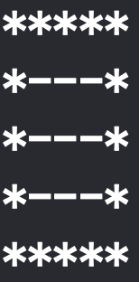

# 流程控制練習

#### 圖形一

##### 1.設置迴圈
```Swift
let sideLength = 5
for _ in 1...sideLength {
    var str = ""
    for _ in 1...sideLength {
        str = showGraph1Row(str: str)
    }
    print(str)
}
```
##### 2.設計函式
```Swift
func showGraph1Row(str:String) -> String {
    return str + "*"
}
```

#### 圖形二

##### 1.設置迴圈
```Swift
let sideLength = 5
for col in 1...sideLength {
    var str = ""
    for row in 1...sideLength {
        str = showGraph2Row(str: str, length: sideLength, col: col, row: row)
    }
    print(str)
}
```
##### 2.設計函式
```Swift
func showGraph2Row(str:String, length:Int, col:Int, row:Int) -> String {
    if col == 1 || col == length || row == 1 || row == length{
        return str + "*"
    }
    return str + "-"
}
```

#### 圖形三

##### 1.設置迴圈
```Swift
let sideLength = 7
for col in 1...sideLength {
    var str = ""
    for row in 1...sideLength {
        str = showGraph3Row(str: str, col: col, row: row)
    }
    print(str)
}
```
##### 2.設計函式
```Swift
func showGraph3Row(str:String, col:Int, row:Int) -> String {
    if col % 2 == 1 || row % 2 == 1{
        return str + "*"
    }
    return str + "-"
}
```
#### 圖形四

##### 1.設置迴圈
```Swift
let sideLength = 7
for col in 1...sideLength {
    var str = ""
    for row in 1...sideLength {
        str = showGraph4Row(str: str, length: sideLength, col: col, row: row)
    }
    print(str)
}
```
##### 2.設計函式
```Swift
func showGraph4Row(str:String, length:Int, col:Int, row:Int) -> String {
    if col == 1 || col == length || row == 1 || row == length{
        return str + "*"
    }else if col >= 3 && col <= length - 2 && row >= 3 && row <= length - 2{
        if col == row && col == length/2+1{
            return str + "-"
        }
        return str + "*"
    }
    return str + "-"
}
```

#### 補充
可以透過「 Sitch...Case... 」與「 Random 」 隨機顯示出圖形

